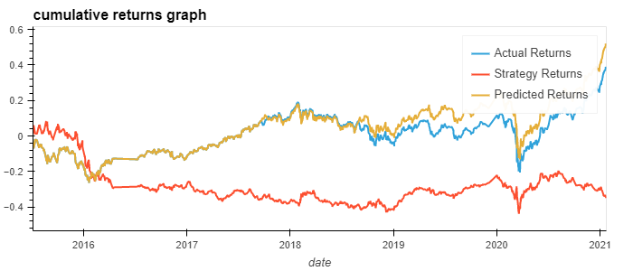
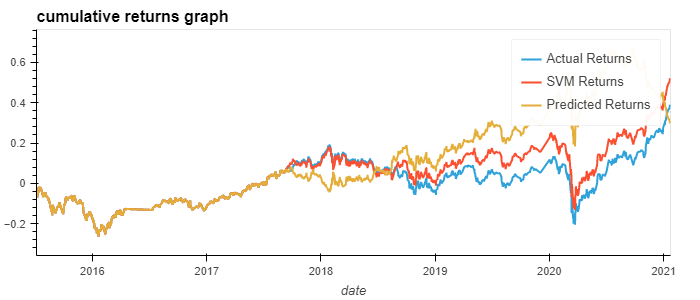

# Algorithmic-Trading
Challenge 14 - University of Berkeley Financial Technology Boot Camp

## Overview
The purpose of this challenge is to improve the existing algorithmic trading systems and maintain a competitive advantage in the marketplace. The goal is to determine which machine learning model is the most effective in predicting stock returns based on a given dataset. The project involves the following steps:

1. Establish a Baseline Performance

2. Tune the Baseline Trading Algorithm
   - Increasing the size of the training dataset.
   - Adjusting the short-window and long-window parameters of the algorithm.

3. Evaluate a New Machine Learning Classifier
   - Implementing the CalibratedClassifierCV model.
   - Comparing its performance with the baseline model.

4. Create an Evaluation Report
 
## Baseline
- (All models use random_state = 1 for consistency)
- The baseline machine learning model provided by this challenge gives us a starting point to compare future results.

        precision    recall  f1-score   support

        -1.0       0.43      0.04      0.07      1804
         1.0       0.56      0.96      0.71      2288
      accuracy                         0.55      4092
     

### Baseline Trading Algorithm -  training dataset (6 Month):
                 
                precision    recall  f1-score   support

        -1.0       0.44      0.02      0.04      1732
         1.0       0.56      0.98      0.71      2211

    accuracy                           0.56      3943
  
### Tune the Baseline Trading Algorithm - SMA windows (Short=50, Long=200)

              precision    recall  f1-score   support

        -1.0       0.00      0.00      0.00      1694
         1.0       0.56      1.00      0.72      2161

    accuracy                           0.56      3855


### Second Machine Learning Model 

              precision    recall  f1-score   support

        -1.0       0.43      0.35      0.39      1804
         1.0       0.56      0.64      0.59      2288

    accuracy                           0.51      4092
 

## Summary
By increasing the size of the training dataset from 3 months to 6 months, the accuracy of the SVC model improved. However, there was minimal change in overall model performance. Adjusting the short-window and long-window parameters also yielded a slight increase in accuracy but failed to predict -1 results accurately. Evaluating the CalibratedClassifierCV model showed lower accuracy than the baseline model but better performance during market dips. The evaluation report provides a comprehensive analysis of each model's performance and their respective strengths and weaknesses.

## Installation and Files
- Python 3.9
- pandas
- numpy
- hvplot
- scikit-learn
- matplotlib

You can install the required packages by running the following command:
```bash
pip install pandas numpy hvplot scikit-learn matplotlib
```
The necessary file for this the emerging_markets_ohlcv.csv found in /Resources
